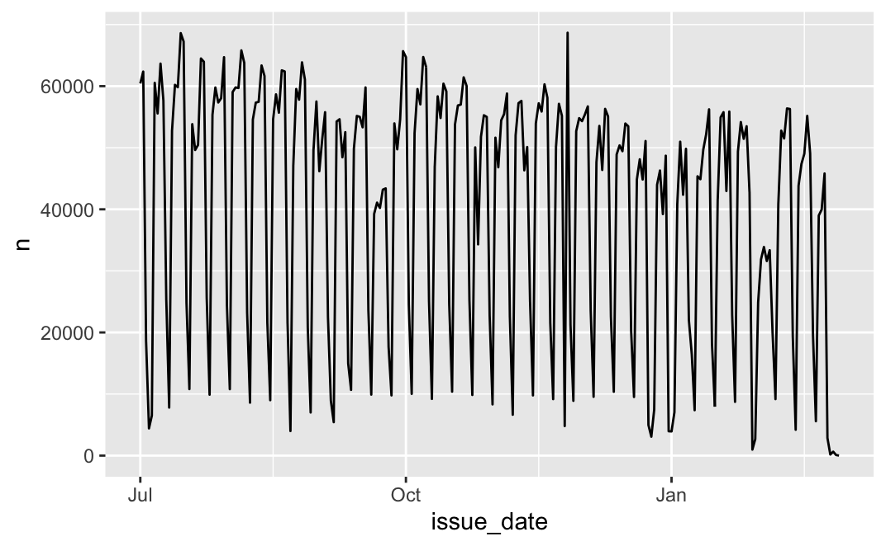
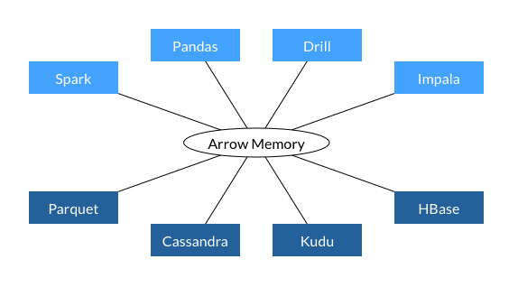

exclude: true

```{r, message=FALSE, warning=FALSE, include=FALSE}
options(
  htmltools.dir.version = FALSE, # for blogdown
  width = 80,
  tibble.width = 80
)

knitr::opts_chunk$set(
  fig.align = "center",
  out.width = "80%",
  dpi = 300,
  fig.retina = 2
)

htmltools::tagList(rmarkdown::html_dependency_font_awesome())

library(dplyr)
library(maptools)
library(sf)
library(purrr)
library(ggplot2)
library(patchwork)

ggplot2::theme_set(ggplot2::theme_bw())

cols = c("#7fc97f","#386cb0","#beaed4","#fdc086")
```

---

## Big vs Bigish data

* We will be working with data that is large, but it will still fit in memory. 

* R *loves* to make extra copies of objects, so we need to be careful - even a handful of copies with exhaust the memory on most systems. 
    
    * Less of an issue on departental server (256 GB of Ram), but this is a shared resource - use too much and your session/process might be killed.


---
## NYC parking ticket data

New York City is at the forefront of the open data movement among local, state and federal governments. They have made publicly available a huge amount of data (NYC Open Data) on everything from street trees, to restaurant inspections, to parking violations.

We will be looking at all parking tickets issued in NYC for the 2022 Fiscal year - the data were obtained from [NYC Open Data](https://data.cityofnewyork.us/City-Government/Parking-Violations-Issued-Fiscal-Year-2022/pvqr-7yc4).

```{r}
fs::file_size("data/Parking_Violations_Issued_-_Fiscal_Year_2022.csv")
```

---

## Reading the data

If we use the basic approach of `read.csv`, we end up waiting awhile,

```{r, eval=FALSE}
system.time(
  read.csv("data/Parking_Violations_Issued_-_Fiscal_Year_2022.csv")
)

##   user  system elapsed 
## 90.764  11.426 108.169 
```

Almost 2 minutes to read in a 1.76 gigabyte CSV file.

---

## Improvements 

If we use `stringsAsFactors=FALSE` and `comment.char=""` arguments we can speed things up a bit.

```{r, eval=FALSE}
system.time(
  read.csv(
    "data/Parking_Violations_Issued_-_Fiscal_Year_2022.csv", 
    stringsAsFactors=FALSE, 
    comment.char=""
  )
)

##   user  system elapsed 
## 75.470  14.124  96.476 
```

We can take this farther by specifying the structure of the data using the `colClasses` argument.

---

## data.table::fread

```{r, eval=FALSE}
system.time({
  nyc_fread = data.table::fread("data/Parking_Violations_Issued_-_Fiscal_Year_2022.csv")
})

## |--------------------------------------------------|
## |==================================================|

##   user  system elapsed 
## 17.233   1.041  21.857 
```


--

```{r eval=FALSE}
class(nyc_fread)

## "data.table" "data.frame"

nyc = as.data.frame(nyc_fread)
class(nyc)

## [1] "data.frame"
```


---

## readr::read_csv

```{r, eval=FALSE}
system.time({
  nyc = readr::read_csv("data/Parking_Violations_Issued_-_Fiscal_Year_2022.csv")
})
  
## Rows: 9980449 Columns: 43
## ── Column specification ──────────────────────────────────────────────────────────────────────────
## Delimiter: ","
## chr (25): Plate ID, Registration State, Plate Type, Issue Date, Vehicle Body Type, Vehicle Mak...
## dbl (14): Summons Number, Violation Code, Street Code1, Street Code2, Street Code3, Vehicle Ex...
## lgl  (4): Violation Legal Code, No Standing or Stopping Violation, Hydrant Violation, Double P...
## 
## ℹ Use `spec()` to retrieve the full column specification for this data.
## ℹ Specify the column types or set `show_col_types = FALSE` to quiet this message.

##   user  system elapsed 
## 55.796  10.596  40.465 
``` 


---

## readr::read_csv - lazy

```{r, eval=FALSE}
system.time({
  nyc_lazy = readr::read_csv("data/Parking_Violations_Issued_-_Fiscal_Year_2022.csv", lazy=TRUE)
})

## Rows: 9980449 Columns: 43
## ── Column specification ──────────────────────────────────────────────────────────────────────────
## Delimiter: ","
## chr (25): Plate ID, Registration State, Plate Type, Issue Date, Vehicle Body Type, Vehicle Mak...
## dbl (14): Summons Number, Violation Code, Street Code1, Street Code2, Street Code3, Vehicle Ex...
## lgl  (4): Violation Legal Code, No Standing or Stopping Violation, Hydrant Violation, Double P...
## 
## ℹ Use `spec()` to retrieve the full column specification for this data.
## ℹ Specify the column types or set `show_col_types = FALSE` to quiet this message.

##    user  system elapsed 
##  13.972   4.729   4.497 
```


--

```{r eval=FALSE}
pryr::object_size(nyc)
## 3,461,255,280 B

pryr::object_size(nyc_lazy)
## 159,707,840 B
```


---

## readr 

This package is part of the tidyverse and is designed to be a fast and friendly way of reading tabular data into R.

<br/>

Core features:

* Faster than base R (~3-4x)

* No strings as factors

* No column name mangling

* Consistent argument/function naming scheme

* Plays nice with dplyr (`tbl_df`)

---

## Ticket Data

```{r, eval=FALSE}
nyc

## # A tibble: 9,980,449 × 43
##    `Summons Number` `Plate ID` `Registration State` `Plate Type` `Issue Date` `Violation Code`
##               <dbl> <chr>      <chr>                <chr>        <chr>                   <dbl>
##  1       1457617912 JEB5683    NY                   PAS          06/25/2021                 40
##  2       1457617924 JAN2986    NY                   PAS          06/25/2021                 20
##  3       1457622427 FJH6630    TX                   PAS          06/17/2021                 98
##  4       1457638629 RD1Y5N     MO                   PAS          06/16/2021                 98
##  5       1457639580 T503814C   NY                   OMT          07/04/2021                 40
##  6       1457643042 JLN5490    NY                   PAS          06/28/2021                 98
##  7       1457663909 UMB4505    VA                   PAS          07/02/2021                 98
##  8       1457670471 JPS7544    NY                   PAS          06/19/2021                 40
##  9       1457670537 UPS7544    NY                   PAS          06/19/2021                 70
## 10       1457677623 07027R5    TX                   PAS          07/03/2021                 74
## # … with 9,980,439 more rows, and 37 more variables: `Vehicle Body Type` <chr>, `Vehicle Make` <chr>,
## #   `Issuing Agency` <chr>, `Street Code1` <dbl>, `Street Code2` <dbl>, `Street Code3` <dbl>,
## #   `Vehicle Expiration Date` <dbl>, `Violation Location` <chr>, `Violation Precinct` <dbl>,
## #   `Issuer Precinct` <dbl>, `Issuer Code` <dbl>, `Issuer Command` <chr>, `Issuer Squad` <chr>,
## #   `Violation Time` <chr>, `Time First Observed` <chr>, `Violation County` <chr>,
## #   `Violation In Front Of Or Opposite` <chr>, `House Number` <chr>, `Street Name` <chr>,
## #   `Intersecting Street` <chr>, `Date First Observed` <dbl>, `Law Section` <dbl>, …
```


---

## Fixing column names

```{r eval=FALSE}
(nyc = janitor::clean_names(nyc))

## # A tibble: 9,980,449 × 43
##    summons_number plate_id registration_sta… plate_type issue_date violation_code vehicle_body_ty… vehicle_make
##             <dbl> <chr>    <chr>             <chr>      <chr>               <dbl> <chr>            <chr>       
##  1     1457617912 JEB5683  NY                PAS        06/25/2021             40 VAN              FORD        
##  2     1457617924 JAN2986  NY                PAS        06/25/2021             20 SUBN             DODGE       
##  3     1457622427 FJH6630  TX                PAS        06/17/2021             98 SDN              AUDI        
##  4     1457638629 RD1Y5N   MO                PAS        06/16/2021             98 SDN              TOYOT       
##  5     1457639580 T503814C NY                OMT        07/04/2021             40 TAXI             HONDA       
##  6     1457643042 JLN5490  NY                PAS        06/28/2021             98 SDN              HONDA       
##  7     1457663909 UMB4505  VA                PAS        07/02/2021             98 SDN              SUBAR       
##  8     1457670471 JPS7544  NY                PAS        06/19/2021             40 SDN              NISSA       
##  9     1457670537 UPS7544  NY                PAS        06/19/2021             70 SDN              NISSA       
## 10     1457677623 07027R5  TX                PAS        07/03/2021             74 SUBN             LEXUS       
## # … with 9,980,439 more rows, and 35 more variables: issuing_agency <chr>, street_code1 <dbl>,
## #   street_code2 <dbl>, street_code3 <dbl>, vehicle_expiration_date <dbl>, violation_location <chr>,
## #   violation_precinct <dbl>, issuer_precinct <dbl>, issuer_code <dbl>, issuer_command <chr>,
## #   issuer_squad <chr>, violation_time <chr>, time_first_observed <chr>, violation_county <chr>,
## #   violation_in_front_of_or_opposite <chr>, house_number <chr>, street_name <chr>, intersecting_street <chr>,
## #   date_first_observed <dbl>, law_section <dbl>, sub_division <chr>, violation_legal_code <lgl>,
## #   days_parking_in_effect <chr>, from_hours_in_effect <chr>, to_hours_in_effect <chr>, vehicle_color <chr>, …
```

---

## Simplifying 

There is a lot of variables we won't care about for the time being, so lets make life easier by selecting a subset of columns.

```{r eval=FALSE}
(nyc_trim = nyc %>% 
  select(
    registration_state:issuing_agency, 
    violation_location, violation_precinct, violation_time,
    house_number:intersecting_street, vehicle_color
  )
)

## # A tibble: 9,980,449 × 14
##    registration_state plate_type issue_date violation_code vehicle_body_type vehicle_make issuing_agency
##    <chr>              <chr>      <chr>               <dbl> <chr>             <chr>        <chr>         
##  1 NY                 PAS        06/25/2021             40 VAN               FORD         P             
##  2 NY                 PAS        06/25/2021             20 SUBN              DODGE        P             
##  3 TX                 PAS        06/17/2021             98 SDN               AUDI         P             
##  4 MO                 PAS        06/16/2021             98 SDN               TOYOT        P             
##  5 NY                 OMT        07/04/2021             40 TAXI              HONDA        P             
##  6 NY                 PAS        06/28/2021             98 SDN               HONDA        P             
##  7 VA                 PAS        07/02/2021             98 SDN               SUBAR        P             
##  8 NY                 PAS        06/19/2021             40 SDN               NISSA        P             
##  9 NY                 PAS        06/19/2021             70 SDN               NISSA        P             
## 10 TX                 PAS        07/03/2021             74 SUBN              LEXUS        P             
## # … with 9,980,439 more rows, and 7 more variables: violation_location <chr>, violation_precinct <dbl>,
## #   violation_time <chr>, house_number <chr>, street_name <chr>, intersecting_street <chr>,
## #   vehicle_color <chr>
```

---

## Size of objects

```{r eval=FALSE}
pryr::object_size(nyc)
## 3,461,255,280 B

pryr::object_size(nyc_fread)
## 2,942,262,600 B

pryr::object_size(nyc_trim)
## 1,137,418,720 B
```


---

## Clean data?

How many different car colors are in this data set?

--

.pull-left[ .small[
```{r eval=FALSE}
nyc %>% 
  count(vehicle_color) %>% 
  arrange(desc(n))

## # A tibble: 953 × 2
##    vehicle_color       n
##    <chr>           <int>
##  1 GY            1943084
##  2 WH            1779206
##  3 BK            1701522
##  4 NA             683723
##  5 WHITE          654584
##  6 BL             653795
##  7 BLACK          423010
##  8 RD             377793
##  9 GREY           302187
## 10 SILVE          162462
## # … with 943 more rows
```
] ]

.pull-right[ .small[
```{r eval=FALSE}
nyc %>% 
  count(vehicle_color)


## # A tibble: 953 × 2
##    vehicle_color     n
##    <chr>         <int>
##  1 -                 1
##  2 - /               1
##  3 -.I.              1
##  4 ?:{              15
##  5 .                 2
##  6 ..                4
##  7 .N                1
##  8 .X                1
##  9 '}                1
## 10 //                4
## # … with 943 more rows
```
] ]

---

## Issue Dates 

```{r, eval=FALSE}
library(lubridate)
class(nyc$issue_date)
## [1] "character"

head(nyc$issue_date)
## [1] "06/25/2021" "06/25/2021" "06/17/2021" "06/16/2021" "07/04/2021" "06/28/2021"

nyc = nyc %>% mutate(issue_date = mdy(issue_date, tz="America/New_York"))
class(nyc$issue_date)
## [1] "POSIXct" "POSIXt"

range(nyc$issue_date)
## [1] "1973-09-24 EDT" "2067-11-28 EST"
```

---

```{r, eval=FALSE}
nyc

## # A tibble: 9,980,449 × 43
##    summons_number plate_id registration_st… plate_type issue_date          violation_code vehicle_body_ty…
##             <dbl> <chr>    <chr>            <chr>      <dttm>                       <dbl> <chr>           
##  1     1457617912 JEB5683  NY               PAS        2021-06-25 00:00:00             40 VAN             
##  2     1457617924 JAN2986  NY               PAS        2021-06-25 00:00:00             20 SUBN            
##  3     1457622427 FJH6630  TX               PAS        2021-06-17 00:00:00             98 SDN             
##  4     1457638629 RD1Y5N   MO               PAS        2021-06-16 00:00:00             98 SDN             
##  5     1457639580 T503814C NY               OMT        2021-07-04 00:00:00             40 TAXI            
##  6     1457643042 JLN5490  NY               PAS        2021-06-28 00:00:00             98 SDN             
##  7     1457663909 UMB4505  VA               PAS        2021-07-02 00:00:00             98 SDN             
##  8     1457670471 JPS7544  NY               PAS        2021-06-19 00:00:00             40 SDN             
##  9     1457670537 UPS7544  NY               PAS        2021-06-19 00:00:00             70 SDN             
## 10     1457677623 07027R5  TX               PAS        2021-07-03 00:00:00             74 SUBN            
## # … with 9,980,439 more rows, and 36 more variables: vehicle_make <chr>, issuing_agency <chr>,
## #   street_code1 <dbl>, street_code2 <dbl>, street_code3 <dbl>, vehicle_expiration_date <dbl>,
## #   violation_location <chr>, violation_precinct <dbl>, issuer_precinct <dbl>, issuer_code <dbl>,
## #   issuer_command <chr>, issuer_squad <chr>, violation_time <chr>, time_first_observed <chr>,
## #   violation_county <chr>, violation_in_front_of_or_opposite <chr>, house_number <chr>,
## #   street_name <chr>, intersecting_street <chr>, date_first_observed <dbl>, law_section <dbl>,
## #   sub_division <chr>, violation_legal_code <lgl>, days_parking_in_effect <chr>, …
```

---

## More date issues

```{r, eval=FALSE}
nyc$issue_date %>% year() %>% table()
##   1973    2000    2001    2002    2005    2006    2007    2009    2010    2011    2012 
##      2      51       5       4       1       2       2       2       9       9      25 
##   2013    2014    2015    2016    2017    2018    2019    2020    2021    2022    2023 
##      3       2       4       5       4       5      17     211 8062258 1917658     108 
##   2024    2025    2026    2027    2028    2029    2030    2031    2032    2046    2061 
##     10       9       2       7       1       3       8      17       1       1       2 
##   2067 
##      1 
```
]

---

```{r, eval=FALSE}
filter(nyc, issue_date >= mdy("1/1/2021"), issue_date <= mdy("12/31/2022"))
## # A tibble: 9,979,916 × 43
##    summons_number plate_id registration_state plate_type issue_date          violation_code
##             <dbl> <chr>    <chr>              <chr>      <dttm>                       <dbl>
##  1     1457617912 JEB5683  NY                 PAS        2021-06-25 00:00:00             40
##  2     1457617924 JAN2986  NY                 PAS        2021-06-25 00:00:00             20
##  3     1457622427 FJH6630  TX                 PAS        2021-06-17 00:00:00             98
##  4     1457638629 RD1Y5N   MO                 PAS        2021-06-16 00:00:00             98
##  5     1457639580 T503814C NY                 OMT        2021-07-04 00:00:00             40
##  6     1457643042 JLN5490  NY                 PAS        2021-06-28 00:00:00             98
##  7     1457663909 UMB4505  VA                 PAS        2021-07-02 00:00:00             98
##  8     1457670471 JPS7544  NY                 PAS        2021-06-19 00:00:00             40
##  9     1457670537 UPS7544  NY                 PAS        2021-06-19 00:00:00             70
## 10     1457677623 07027R5  TX                 PAS        2021-07-03 00:00:00             74
## # … with 9,979,906 more rows, and 37 more variables: vehicle_body_type <chr>,
## #   vehicle_make <chr>, issuing_agency <chr>, street_code1 <dbl>, street_code2 <dbl>,
## #   street_code3 <dbl>, vehicle_expiration_date <dbl>, violation_location <chr>,
## #   violation_precinct <dbl>, issuer_precinct <dbl>, issuer_code <dbl>, issuer_command ## <chr>,
## #   issuer_squad <chr>, violation_time <chr>, time_first_observed <chr>,
## #   violation_county <chr>, violation_in_front_of_or_opposite <chr>, house_number <chr>,
## #   street_name <chr>, intersecting_street <chr>, date_first_observed <dbl>, …
```
]

---

## Performance?

```{r, eval=FALSE}
system.time(
  filter(nyc, issue_date >= mdy("1/1/2021"), issue_date <= mdy("12/31/2022"))
)
  
##   user  system elapsed 
##  1.079   0.856   2.396 

system.time(
  filter(nyc, year(issue_date) %in% c(2013, 2014))
)
  
##   user  system elapsed 
##  1.007   0.085   1.090  
```

---

## Putting it all together

```{r, eval=FALSE}
nyc = readr::read_csv("data/Parking_Violations_Issued_-_Fiscal_Year_2022.csv") %>%
  janitor::clean_names() %>%
  select(registration_state:issuing_agency, 
       violation_location, violation_precinct, violation_time,
       house_number:intersecting_street, vehicle_color) %>%
  mutate(issue_date = mdy(issue_date)) %>% 
  mutate(issue_day = day(issue_date),
         issue_month = month(issue_date),
         issue_year = year(issue_date),
         issue_wday = wday(issue_date, label=TRUE)) %>%
  filter(issue_year %in% 2021:2022)

nyc

## # A tibble: 9,979,916 × 18
##    registration_state plate_type issue_date violation_code vehicle_body_type vehicle_make
##    <chr>              <chr>      <date>              <dbl> <chr>             <chr>       
##  1 NY                 PAS        2021-06-25             40 VAN               FORD        
##  2 NY                 PAS        2021-06-25             20 SUBN              DODGE       
##  3 TX                 PAS        2021-06-17             98 SDN               AUDI        
##  4 MO                 PAS        2021-06-16             98 SDN               TOYOT       
##  5 NY                 OMT        2021-07-04             40 TAXI              HONDA       
##  6 NY                 PAS        2021-06-28             98 SDN               HONDA       
##  7 VA                 PAS        2021-07-02             98 SDN               SUBAR       
##  8 NY                 PAS        2021-06-19             40 SDN               NISSA       
##  9 NY                 PAS        2021-06-19             70 SDN               NISSA       
## 10 TX                 PAS        2021-07-03             74 SUBN              LEXUS       
## # … with 9,979,906 more rows, and 12 more variables: issuing_agency <chr>,
## #   violation_location <chr>, violation_precinct <dbl>, violation_time <chr>,
## #   house_number <chr>, street_name <chr>, intersecting_street <chr>, vehicle_color <chr>,
## #   issue_day <int>, issue_month <dbl>, issue_year <dbl>, issue_wday <ord>
```


---

## Ticket Frequency 

```{r, eval=FALSE}
nyc %>% 
  count(issue_date) %>% 
  ggplot(aes(x=issue_date, y=n)) + 
    geom_line()+
    xlim(mdy("7/1/2021"), mdy("2/28/2022"))
```

```{r echo=FALSE}

```

---

## Demos

Some dplyr practice,

1. Create a plot of the weekly pattern (tickets issued per day of the week) - When are you most likely to get a ticket and when are you least likely to get a ticket?

2. Which precinct issued the most tickets to Toyotas?

---
class: center, middle

## Arrow

---

## Apache Arrow

> Apache Arrow is a software development platform for building high performance applications that process and transport large data sets. It is designed to both improve the performance of analytical algorithms and the efficiency of moving data from one system or programming language to another.
>
> A critical component of Apache Arrow is its in-memory columnar format, a standardized, language-agnostic specification for representing structured, table-like datasets in-memory. This data format has a rich data type system (included nested and user-defined data types) designed to support the needs of analytic database systems, data frame libraries, and more.

```{r echo=FALSE, out.width='40%', fig.align="center"}
knitr::include_graphics("imgs/arrow_cols.png")
```

---

## Language support

.pull-left-narrow[
Core implementations in:

* C
* C++
* C#
* go
* Java
* JavaScript
* Julia
* Rust
* MATLAB
* Python
* R
* Ruby
]

.pull-right-wide[
```{r echo=FALSE, out.width='80%', fig.align="center"}

```
]

---

## Arrow + CSV

```{r eval=FALSE}
system.time({
  nyc_arrow_df = arrow::read_csv_arrow(
    "data/Parking_Violations_Issued_-_Fiscal_Year_2022.csv"
  )
})

##   user  system elapsed 
##  9.331  19.270  11.000 
```

--

```{r eval=FALSE}
system.time({
  nyc_arrow = arrow::read_csv_arrow(
    "data/Parking_Violations_Issued_-_Fiscal_Year_2022.csv",
    as_data_frame = FALSE
  )
})

##   user  system elapsed 
##  8.860  12.826   7.174 
```

---

## Arrow tables

```{r eval=FALSE}
nyc_arrow
## Table
## 9980449 rows x 43 columns
## $Summons Number <int64>
## $Plate ID <string>
## $Registration State <string>
## $Plate Type <string>
## $Issue Date <string>
## $Violation Code <int64>
## $Vehicle Body Type <string>
## $Vehicle Make <string>
## $Issuing Agency <string>
## $Street Code1 <int64>
## $Street Code2 <int64>
## $Street Code3 <int64>
## $Vehicle Expiration Date <int64>
## $Violation Location <int64>
## $Violation Precinct <int64>
## $Issuer Precinct <int64>
## $Issuer Code <int64>
## $Issuer Command <string>
## $Issuer Squad <string>
## $Violation Time <string>
## $Time First Observed <string>
## $Violation County <string>
## $Violation In Front Of Or Opposite <string>
## $House Number <string>
## $Street Name <string>
## $Intersecting Street <string>
## $Date First Observed <int64>
## $Law Section <int64>
## $Sub Division <string>
## $Violation Legal Code <string>
## $Days Parking In Effect     <string>
## $From Hours In Effect <string>
## $To Hours In Effect <string>
## $Vehicle Color <string>
## $Unregistered Vehicle? <int64>
## $Vehicle Year <int64>
## $Meter Number <string>
## $Feet From Curb <int64>
## $Violation Post Code <string>
## $Violation Description <string>
## $No Standing or Stopping Violation <null>
## $Hydrant Violation <null>
## $Double Parking Violation <null>
```

---
class: center, middle

## An aside on tabular file formats

---

## Comma Separated Values

This and other text & delimiter based file formats are the most common and generally considered the most portable, however they have a number of significant draw backs

* no explicit schema or other metadata

* column types must be inferred from the data

* numerical values stored as text (efficiency and precision issues)

* limited compression options

---

## (Apache) Parquet

> ... provides a standardized open-source columnar storage format for use in data analysis systems. It was created originally for use in Apache Hadoop with systems like Apache Drill, Apache Hive, Apache Impala, and Apache Spark adopting it as a shared standard for high performance data IO.


Core features:
> The values in each column are physically stored in contiguous memory locations and this columnar storage provides the following benefits:
>
> * Column-wise compression is efficient and saves storage space
> * Compression techniques specific to a type can be applied as the column values tend to be of the same type
> * Queries that fetch specific column values need not read the entire row data thus improving performance
> * Different encoding techniques can be applied to different columns


---

## Feather

> ... is a portable file format for storing Arrow tables or data frames (from languages like Python or R) that utilizes the Arrow IPC format internally. Feather was created early in the Arrow project as a proof of concept for fast, language-agnostic data frame storage for Python (pandas) and R.

Core features:
* Direct columnar serialization of Arrow tables

* Supports all Arrow data types and compression

* Language agnostic

* Metadata makes it possible to read only the necessary columns for an operation

---

## File sizes

```{r}
fs::file_size(
  "data/Parking_Violations_Issued_-_Fiscal_Year_2022.csv"
)

fs::file_size(
  "data/Parking_Violations_Issued_-_Fiscal_Year_2022.parquet"
)

fs::file_size(
  "data/Parking_Violations_Issued_-_Fiscal_Year_2022.feather"
)
```

---

## Read performance

```{r eval=FALSE}
system.time(
  arrow::read_csv_arrow(
    "data/Parking_Violations_Issued_-_Fiscal_Year_2022.csv"
  )
)
##   user  system elapsed 
##  9.456  18.643  10.660 
```

--

```{r eval=FALSE}
system.time(
  arrow::read_parquet(
    "data/Parking_Violations_Issued_-_Fiscal_Year_2022.parquet"
  )
)
##   user  system elapsed 
##  4.548   1.545   1.166 
```

--

```{r eval=FALSE}
system.time(
  arrow::read_feather(
    "data/Parking_Violations_Issued_-_Fiscal_Year_2022.feather"
  )
)
##   user  system elapsed 
##  0.774   1.846   0.975 
```

---

## Read performance - column subset

```{r eval=FALSE}
system.time(
  arrow::read_csv_arrow(
    "data/Parking_Violations_Issued_-_Fiscal_Year_2022.csv",
    col_select = "Violation Precinct"
  )
)
##   user  system elapsed 
##  9.457  18.202  10.182 
```

--

```{r eval=FALSE}
system.time(
  arrow::read_parquet(
    "data/Parking_Violations_Issued_-_Fiscal_Year_2022.parquet",
    col_select = "Violation Precinct"
  )
)
##   user  system elapsed 
##  0.066   0.011   0.080 
```

--

```{r eval=FALSE}
system.time(
  arrow::read_feather(
    "data/Parking_Violations_Issued_-_Fiscal_Year_2022.feather",
    col_select = "Violation Precinct"
  )
)
##   user  system elapsed 
##  0.047   0.044   0.090 
```